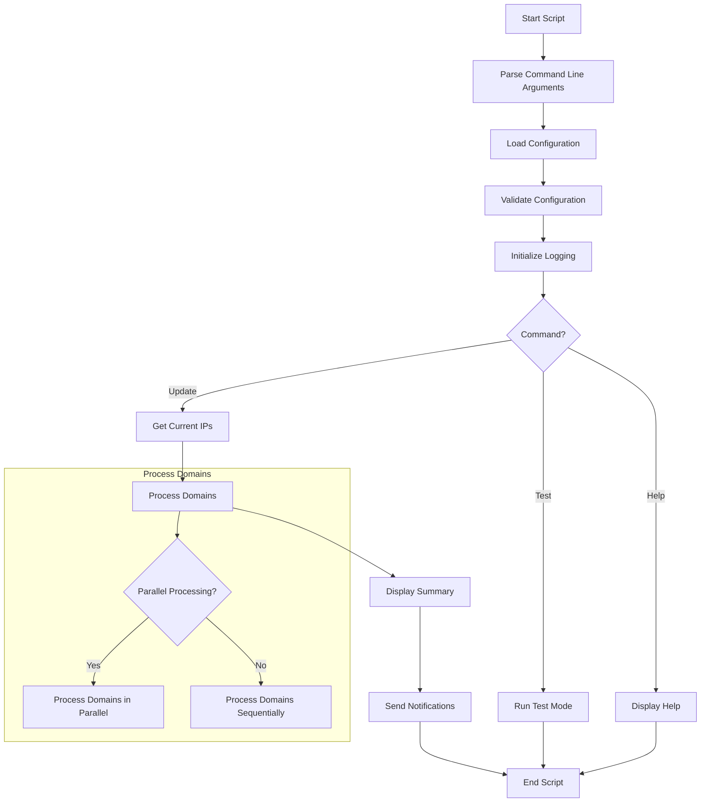
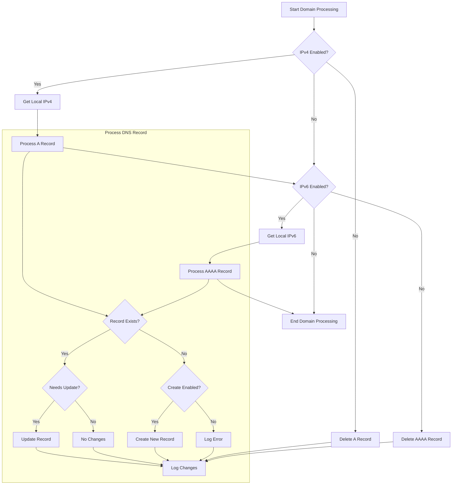
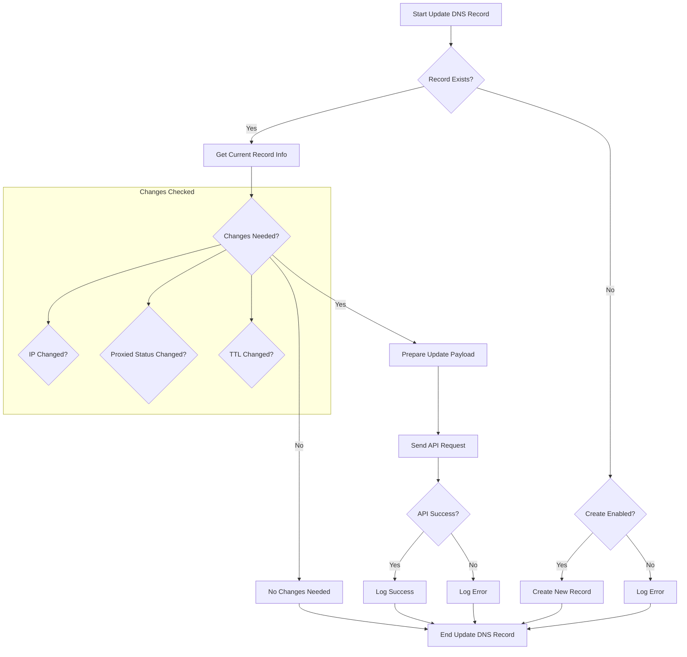

# Cloudflare DNS Updater

## Table of Contents

1. [Description](#description)
2. [Features](#features)
3. [Requirements](#requirements)
4. [Installation](#installation)
5. [Configuration](#configuration)
6. [Usage](#usage)
7. [Examples](#examples)
9. [Flowcharts](#flowcharts)
10. [Dependencies](#dependencies)
11. [Troubleshooting](#troubleshooting)
12. [Contributing](#contributing)
13. [License](#license)

## Description

Cloudflare DNS Updater is a bash script designed to automate the management of DNS records in Cloudflare. It allows updating A (IPv4) and AAAA (IPv6) records for multiple domains, offering flexible configuration options and various notification methods.

## Features

- **DNS Record Management**:

  - Update A (IPv4) and AAAA (IPv6) records
  - Support for multiple domains
  - Create new DNS records if they don't exist (optional)
  - Delete DNS records when IPv4 or IPv6 is set to false
- **Configuration**:

  - YAML configuration file for easy setup
  - Command-line options for quick adjustments
  - Support for environment variables for sensitive data
- **Performance**:

  - Parallel processing of domains
  - Configurable retry mechanism for API requests
- **Testing and Debugging**:

  - Test mode (dry run) for verification without making changes
  - Extensive logging capabilities
  - Debug mode for detailed output
- **Notification Systems**:

  - Multiple notification methods (Email, Telegram, Slack, Discord)
- **User Interface**:

  - Colorized terminal output with progress indication
  - Man page for easy reference

## Requirements

### Mandatory

- [Bash](#bash-40-required) 4.0+
- [curl](#curl-required)
- [jq](#jq-required) (JSON parser)

### Recommended

- [yq](#yq-optional-required-for-using-yaml-configuration) (YAML parser)

### Optional

- [openssl](#openssl-optional-required-for-ssltls-connections-in-email-notifications) (for email notifications)
- [netcat](#netcat-optional-required-for-email-notifications) (for email notifications)

## Installation

1. Clone the repository:

   ```shell
   git clone https://github.com/yourusername/cloudflare-dns-updater.git
   ```
2. Make the script executable:

   ```shell
   chmod +x cloudflare-dns.sh
   ```
3. (Optional) Copy the script to a directory in your PATH for system-wide access:

   ```shell
   sudo cp cloudflare-dns.sh /usr/local/bin/cloudflare-dns
   ```
4. (Optional) Install the man page:

   ```shell
   sudo mkdir -p /usr/local/man/man1
   sudo cp cloudflare-dns.1 /usr/local/man/man1/
   sudo mandb
   ```

## Configuration

Create a YAML configuration file named `cloudflare-dns.yaml` in the same directory as the script or specify a custom path using the `-c` option. Here's an example configuration:

```yaml
# Cloudflare account settings
cloudflare:
  zone_id: "your_zone_id_here"
  zone_api_token: "your_api_token_here"

# Global settings (applied to all domains unless overridden)
globals:
  ipv4: true
  ipv6: true
  proxied: true
  ttl: auto
  enable_create_record: false

# Domain-specific settings
domains:
  - name: example.com
    ipv4: true
    ipv6: true
    proxied: true
    ttl: 1
  - name: subdomain.example.com
    ipv4: true
    ipv6: false
    proxied: false
    ttl: 3600

# Advanced settings
advanced:
  retry_attempts: 3
  retry_interval: 5
  max_parallel_jobs: 5

# Notification settings
notifications:
  telegram:
    enabled: false
    bot_token: "your_telegram_bot_token"
    chat_id: "your_telegram_chat_id"
  email:
    enabled: true
    smtp_server: "smtp.example.com"
    smtp_port: 587
    use_ssl: true
    username: "your_email@example.com"
    password: "your_email_password"
    from_address: "your_email@example.com"
    to_address: "recipient@example.com"
    subject: "Cloudflare DNS Update Notification"
  slack:
    enabled: false
    webhook_url: "https://hooks.slack.com/services/YOUR/SLACK/WEBHOOK"
  discord:
    enabled: false
    webhook_url: "https://discord.com/api/webhooks/YOUR/DISCORD/WEBHOOK"

# Logging settings
logging:
  file: "cloudflare-dns.log"
  terminal_output: true
  verbosity: "success"
  max_size: 10485760  # 10 MB in bytes
  rotate_count: 5
  compress_days: 7
  clean_days: 30
  log_to_system: false
  sanitize_logs: true
```

## How to obtain Cloudflare API Token and Zone ID

1. API Token:

   - Log in to your Cloudflare account.
   - Go to "My Profile" > "API Tokens".
   - Click "Create Token".
   - Use the "Edit zone DNS" template or create a custom token with the necessary permissions
     Copy the generated token.
2. Zone ID:

   - Log in to your Cloudflare account.
   - Select the domain you want to manage.
   - The Zone ID is displayed on the right side of the overview page.
   - Copy the Zone ID.

## Usage

Basic usage:

```shell
cloudflare-dns [COMMAND] [OPTIONS]
```

### Commands


| Command | Description                                       |
| ------- | ------------------------------------------------- |
| update  | Update DNS records for specified domains          |
| test    | Run in test mode (dry run) without making changes |
| help    | Show help message and exit                        |

### Options


| Option                | Description                             | Default Value       |
| --------------------- | --------------------------------------- | ------------------- |
| -h, --help            | Show help message and exit              | -                   |
| -c, --config FILE     | Specify the configuration file          | cloudflare-dns.yaml |
| -q, --quiet           | Disable terminal output                 | false               |
| -v, --verbosity LEVEL | Set log verbosity level                 | success             |
| -p, --parallel NUM    | Set the maximum number of parallel jobs | 1                   |
| --version             | Show version information and exit       | -                   |

### Update Command Options


| Option               | Description                               | Default Value |
| -------------------- | ----------------------------------------- | ------------- |
| --zone-id ID         | Cloudflare Zone ID                        | -             |
| --token TOKEN        | Cloudflare API Token                      | -             |
| --domains D1,D2,...  | Comma-separated list of domains to update | -             |
| --ipv4 BOOL          | Update IPv4 records                       | true          |
| --ipv6 BOOL          | Update IPv6 records                       | true          |
| --proxied BOOL       | Enable Cloudflare proxying                | true          |
| --ttl NUM            | Set TTL for DNS records                   | 1 (Auto)      |
| --create-record BOOL | Enable creation of missing records        | false         |

### Logging Options


| Option                     | Description                                           | Default Value      |
| -------------------------- | ----------------------------------------------------- | ------------------ |
| --log-file FILE            | Specify log file                                      | cloudflare-dns.log |
| --log-max-size BYTES       | Maximum log file size before rotation                 | 10485760 (10MB)    |
| --log-rotate-count NUM     | Number of rotated log files to keep                   | 5                  |
| --log-compress-days NUM    | Days after which to compress old logs                 | 7                  |
| --log-clean-days NUM       | Days after which to delete old logs                   | 30                 |
| --log-to-system BOOL       | Send logs to the operating system's logging system    | false              |
| --disable-log-sanitization | Disable sanitization of sensitive information in logs | false              |

### Verbosity Levels

The `--verbosity` option accepts the following levels:

- `debug_logging`: Most detailed logging, including debug information about the logging system itself
- `debug`: Detailed information, typically of interest only when diagnosing problems
- `info`: Confirmation that things are working as expected
- `warning`: An indication that something unexpected happened, or indicative of some problem in the near future
- `error`: Due to a more serious problem, the software has not been able to perform some function
- `success`: Information about successful operations (default)

### Environment Variables


| Variable     | Description                                              |
| ------------ | -------------------------------------------------------- |
| CF_API_TOKEN | Cloudflare API Token (overrides config file and --token) |
| CF_ZONE_ID   | Cloudflare Zone ID (overrides config file and --zone-id) |

## Examples

1. Update DNS records using the default configuration file:

   ```shell
   cloudflare-dns update
   ```
2. Update DNS records using a custom configuration file:

   ```shell
   cloudflare-dns update -c my_config.yaml
   ```
3. Run in test mode (dry run) without making changes:

   ```shell
   cloudflare-dns test
   ```
4. Update specific domains:

   ```shell
   cloudflare-dns update --domains example.com,subdomain.example.com
   ```
5. Use environment variables for sensitive data:

   ```shell
   export CF_API_TOKEN="your_api_token_here"
   export CF_ZONE_ID="your_zone_id_here"
   cloudflare-dns update
   ```

   Or:

   ```shell
   CF_API_TOKEN=your_token CF_ZONE_ID=your_zone_id cloudflare-dns update
   ```
6. Update DNS records with custom options:

   ```shell
   cloudflare-dns update --ipv4 false --ipv6 true --proxied false --ttl 3600
   ```
7. Run with custom logging options:

   ```shell
   cloudflare-dns update --log-file /var/log/cf-dns-update.log --log-max-size 20971520 --log-rotate-count 10 --verbosity debug
   ```
8. Enable system logging and disable log sanitization:

   ```shell
   cloudflare-dns update --log-to-system true --disable-log-sanitization
   ```

## Step-by-step Example: Configuring and Updating Multiple Domains

1. Create a configuration file cloudflare-dns.yaml:

   ```yaml
   cloudflare:
     zone_id: "44d43a33307a232a60a5af4fc1504613"
     zone_api_token: "rY7s0ciXH9ARs3FkxChCdBIti_X15oT_bSUN7xQP"

   globals:
     ipv4: true
     ipv6: true
     proxied: true
     ttl: auto

   domains:
     - name: example.com
     - name: blog.example.com
       ipv6: false
     - name: api.example.com
       proxied: false
       ttl: 3600

   advanced:
     retry_attempts: 3
     retry_interval: 5
     max_parallel_jobs: 2

   notifications:
     email:
       enabled: true
       smtp_server: "smtp.gmail.com"
       smtp_port: 587
       use_ssl: true
       username: "your_email@gmail.com"
       password: "your_gmail_app_password"
       from_address: "your_email@gmail.com"
       to_address: "admin@example.com"

   logging:
     file: "cloudflare-dns.log"
     terminal_output: true
     verbosity: "info"
   ```
2. Run the script in test mode:

   ```shell
   cloudflare-dns test -c cloudflare-dns.yaml
   ```

   This will show what changes would be made without actually applying them.
3. If satisfied with the proposed changes, run the script to update the records:

   ```shell
   cloudflare-dns update -c cloudflare-dns.yaml
   ```
4. Review the terminal output and log file to confirm the changes were applied correctly.

## Flowcharts

This section provides visual representations of the script's workflow and decision-making processes. These flowcharts aim to help users understand the inner workings of the Cloudflare DNS Updater script.

### Main Script Flowchart

The following diagram illustrates the main flow of the script, from startup to completion:


This flowchart shows the overall structure of the script, including configuration loading, command processing, and the main update process.

### Domain Processing Flowchart

The following diagram details how each domain is processed:


This flowchart illustrates how the script handles both IPv4 (A records) and IPv6 (AAAA records) for each domain, including the decision process for updating, creating, or deleting records.

### Update DNS Record Flowchart

The following diagram shows the detailed process of updating a single DNS record:


This flowchart provides a detailed view of how the script determines whether a DNS record needs to be updated and the steps involved in the update process.

These flowcharts are designed to be interconnected, with the Domain Processing Flowchart being a more detailed view of the "Process Domains" step in the Main Script Flowchart, and the Update DNS Record Flowchart expanding on the "Process DNS Record" subgraph in the Domain Processing Flowchart.

## Dependencies

### Bash 4.0+ (Required)

Generally pre-installed on Linux systems. On macOS, you can update it using Homebrew:

```shell
brew install bash
```
[More information about Bash](https://www.gnu.org/software/bash/).

### curl (Required)

Tool for transferring data with URL syntax. Installation:

- On Ubuntu/Debian: `sudo apt-get install curl`
- On CentOS/Fedora: `sudo yum install curl`
- On macOS with Homebrew: `brew install curl`

[More information about curl](https://curl.se/).

### jq (Required)

Command-line JSON processor. Installation:

- On Ubuntu/Debian: `sudo apt-get install jq`
- On CentOS/Fedora: `sudo yum install jq`
- On macOS with Homebrew: `brew install jq`

[More information about jq](https://stedolan.github.io/jq/).

### yq (Optional. Required for using YAML configuration)

Command-line YAML processor. Installation:

- On Ubuntu/Debian: `sudo apt-get install yq`
- On CentOS/Fedora: `sudo yum install yq`
- On macOS with Homebrew: `brew install yq`

[More information about yq](https://mikefarah.gitbook.io/yq/).

### openssl (Optional. Required for SSL/TLS connections in email notifications)

Cryptography toolkit. Generally pre-installed. If not:

- On Ubuntu/Debian: `sudo apt-get install openssl`
- On CentOS/Fedora: `sudo yum install openssl`
- On macOS with Homebrew: `brew install openssl`

[More information about openssl](https://www.openssl.org/).

### netcat (Optional. Required for email notifications)

Networking utility for reading from and writing to network connections. Installation:

- On Ubuntu/Debian: `sudo apt-get install netcat`
- On CentOS/Fedora: `sudo yum install netcat`
- On macOS with Homebrew: `brew install netcat`

[More information about netcat](http://netcat.sourceforge.net/).

## Troubleshooting

1. **Script cannot connect to Cloudflare API**
   - Check your internet connection.
   - Ensure your Cloudflare API token is valid and has the correct permissions.
   - Review debug logs for more information.
   - Verify that the Cloudflare API endpoint is not blocked by your firewall.
2. **DNS records are not updating**
   - Confirm that domains are correctly configured in the YAML file.
   - Verify that you have permissions to modify DNS records in Cloudflare.
   - Run the script in debug mode for more details.
   - Check if the Cloudflare zone (domain) is active and not pending.
3. **Notifications are not being sent**
   - Review notification settings in the YAML file.
   - Ensure your notification service credentials are correct.
   - Verify that your mail server or webhook service is functioning properly.
   - Check your firewall settings to ensure outgoing connections are allowed.
4. **Script is running slowly**
   - Reduce the number of domains being processed simultaneously.
   - Check your internet connection speed.
   - Ensure that your system's DNS resolution is working correctly.
5. **Error: "jq: command not found" or similar**
   - Make sure all dependencies are installed correctly.
   - Verify that the installed tools are in your system's PATH.
   - Try reinstalling the missing dependency.
6. **YAML parsing errors**
   - Validate your YAML configuration file syntax. Use an online YAML validator or a linter. Examples: [YAML Lint](http://www.yamllint.com/), [Online YAML Parser](https://yaml-online-parser.appspot.com/).
   - Ensure there are no tabs used for indentation (use spaces instead).
   - Check for any special characters that might need to be escaped.
7. **Permission denied errors**
   - Ensure the script has execute permissions (chmod +x cloudflare-dns.sh).
   - Check if you have write permissions for the log file directory.
8. **API rate limiting issues**
   - Increase the retry_interval in the advanced settings.
   - Reduce the max_parallel_jobs to lower the number of simultaneous API calls.

For additional help, review the debug logs or open an issue on the GitHub repository.

## Contributing

Contributions are welcome! Please feel free to submit a Pull Request (AKA Merge Request) with your changes or improvements. If you encounter any issues or have suggestions for new features, please open an issue on the GitHub repository.

## License

This project is licensed under the GNU General Public License v3.0. For more information, see the [LICENSE](LICENSE) file.
