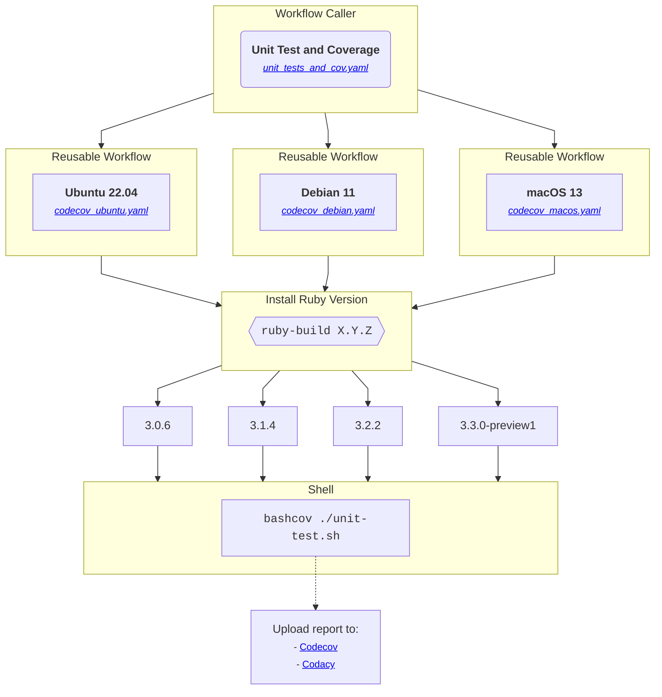

[](https://app.fossa.com/projects/git%2Bgithub.com%2Fjmrplens%2FDynDNS_Cloudflare_IPv4-6?ref=badge_small)
[](https://codecov.io/github/jmrplens/DynDNS_Cloudflare_IPv4-6)
[](https://github.com/jmrplens/DynDNS_Cloudflare_IPv4-6/actions/workflows/unit_tests_and_cov.yaml)


# 1. Dynamic DNS - Cloudflare

Bash script to update IPv4 and IPv6 records in Cloudflare. Update with WAN or LAN IP.

- [1. Dynamic DNS - Cloudflare](#1-dynamic-dns---cloudflare)
  - [1.1. Real life example](#11-real-life-example)
  - [1.2. About](#12-about)
  - [1.3. Requirements](#13-requirements)
  - [1.4. Installation](#14-installation)
  - [1.5. Configuration file](#15-configuration-file)
  - [1.6. Configuration Parameters](#16-configuration-parameters)
  - [1.7. Running The Script](#17-running-the-script)
  - [1.8. Automation With Crontab](#18-automation-with-crontab)
  - [1.9. Logs](#19-logs)
- [2. Information for Developers](#2-information-for-developers)
  - [2.1. Units Test y Code Coverage](#21-units-test-y-code-coverage)
  - [2.2. Github CI (actions)](#22-github-ci-actions)
- [3. More info](#3-more-info)
  - [3.1. Code Quality](#31-code-quality)
  - [3.2. Code Coverage](#32-code-coverage)
  - [3.3. License](#33-license)
## 1.1. Real life example

<table>
<tr>
<td> Result </td> <td> Settings </td>
</tr>
<tr>
<td>  </td>
<td>

```yaml
domains:
    - name: jmrp.dev
      ip_type: external
      ipv4: true
      ipv6: true
      proxied: true
      ttl: auto
    - name: git.jmrp.dev
      ip_type: external
      ipv4: true
      ipv6: true
      proxied: true
      ttl: auto
    - name: jenkins.jmrp.dev
      ip_type: external
      ipv4: true
      ipv6: true
      proxied: true
      ttl: auto

settings:
    cloudflare:
        - zone_id: #########
        - zone_api_token: ########
    misc:
        - create_if_no_exist: false

notifications:
    telegram:
        enabled: false
        bot_token: token
        chat_id: id
```

</td>
</tr>
</table>

## 1.2. About

- Bash Script for most **Linux**, **Unix** distributions and **MacOS**.
- Choose any source IP address to update **external** or **internal** _(WAN/LAN)_ for ech domain.
- For multiply lan interfaces like Wifi, Docker Networks and Bridges the script will automatically detects the primary Interface by priority.
- Cloudflare's options proxy and TTL configurable via the config file for each domain.
- Optional Telegram Notifications


## 1.3. Requirements

- [curl](https://everything.curl.dev/get)
- Cloudflare [api-token](https://dash.cloudflare.com/profile/api-tokens) with ZONE-DNS-EDIT Permissions
- DNS Record must be pre created in web interface (WIP: Create record if no exist)

### Creating Cloudflare API Token

To create a CloudFlare API token for your DNS zone go to [cloudflare-api-token-url](https://dash.cloudflare.com/profile/api-tokens) and follow these steps:

1. Click Create Token
2. Select Create Custom Token
3. Provide the token a name, for example, `example.com-dns-zone-readonly`
4. Grant the token the following permissions:
   - Zone - DNS - Edit
5. Set the zone resources to:
   - Include - Specific Zone - `example.com`
6. Complete the wizard and use the generated token at the `CLOUDFLARE_API_TOKEN` variable for the container

## 1.4. Installation

You can place the script at any location manually.

**MacOS**: Don't use the _/usr/local/bin/_ for the script location. Create a separate folder under your user path _/Users/${USER}_

The automatic install examples below will place the script at _/usr/local/bin/_

```shell
wget https://raw.githubusercontent.com/jmrplens/DyDNS_Cloudflare_IPv4-6/main/cloudflare-dns.sh
sudo chmod +x cloudflare-dns.sh
sudo mv cloudflare-dns.sh /usr/local/bin/cloudflare-dns
```

## 1.5. Configuration file

You can use default config file _cloudflare-dns.yaml_ or pass your own config file as parameter to script.

```shell
wget https://raw.githubusercontent.com/jmrplens/DyDNS_Cloudflare_IPv4-6/main/cloudflare-dns.yaml
```

Place the **config** file in the directory as the **update-cloudflare-dns** for above example at _/usr/local/bin/_

```shell
sudo mv cloudflare-dns.yaml /usr/local/bin/cloudflare-dns.yaml
```

## 1.6. Configuration Parameters

```yaml
domains:
  - name: example.com
    ip_type: external
    ipv4: true
    ipv6: true
    proxied: true
    ttl: auto

settings:
  cloudflare:
    - zone_id: #########
    - zone_api_token: ########
  misc:
    - create_if_no_exist: false

notifications:
  telegram:
    enabled: false
    bot_token: token
    chat_id: id
```

Multiple domains is supported:

```yaml
domains:
  - name: example.com
    ip_type: external
    ipv4: true
    ipv6: true
    proxied: true
    ttl: auto
  - name: example2.com
    ip_type: external
    ipv4: true
    ipv6: true
    proxied: true
    ttl: auto
  - name: ..........
.........
```

#### Domains

| **Option**                | **Example**       | **Description**                                                                                                           |
| ------------------------- | ----------------- | ------------------------------------------------------------------------------------------------------------------------- |
| name                      | example.com       | Domain name. **Required**                                                                                                 |
| ip_type                   | external          | Which IP should be used for the record: internal/external. **Optional** (default: external)                               |
| ipv4                      | true              | Update IPv4 DNS Record: true/false. **Optional** (default: true)                                                          |
| ipv6                      | true              | Update IPv6 DNS Record: true/false. **Optional** (default: true)                                                          |
| proxied                   | true              | Use Cloudflare proxy on dns record: true/false. **Optional** (default: true)                                              |
| ttl                       | 3600              | 120-7200 in seconds or auto. **Optional** (default: auto)                                                                 |

#### Cloudflare

| **Option**                | **Example**       | **Description**                                                                                                           |
| ------------------------- | ----------------- | ------------------------------------------------------------------------------------------------------------------------- |
| zone_api_token            | token             | Cloudflare [API Token](https://dash.cloudflare.com/profile/api-tokens) **KEEP IT PRIVATE!!!!**                                                                              |
| zone_id                   | id                | Cloudflare's [Zone ID](https://developers.cloudflare.com/fundamentals/get-started/basic-tasks/find-account-and-zone-ids/) |

##### Cloudflare misc

| **Option**                | **Example**       | **Description**                                                                                                           |
| ------------------------- | ----------------- | ------------------------------------------------------------------------------------------------------------------------- |
| create_if_no_exist        | false             | Not yet implemented                                                                                                       |

#### Notifications

##### Telegram

| **Option**              | **Example** | **Description**                          |
| ----------------------- | ----------- | ---------------------------------------- |
| enabled                 | true        | Use Telegram notifications: true/false.  |
| bot_token               | token       | Telegram's Bot API Token                 |
| chat_id                 | id          | Chat ID of the bot                       |

## 1.7. Running The Script

When placed in _/usr/local/bin/_

```shell
cloudflare-dns dyndns-update
```

With your config file (need to be placed in same folder)

```shell
cloudflare-dns dyndns-update your_config.yaml
```

## 1.8. Automation With Crontab

You can run the script via crontab

```shell
crontab -e
```

### Examples

<table>
<tr>
<td> Example </td> <td> Code </td>
</tr>
<tr>
  <td> Run <a href="https://crontab.guru/every-1-minute">every minute</a> </td>
<td>

```shell
* * * * * /usr/local/bin/cloudflare-dns dyndns-update
```

</td>
</tr>
<tr>
  <td> Run every minute with your specific config file </td>
<td>

```shell
* * * * * /usr/local/bin/cloudflare-dns dyndns-update myconfig.yaml
```

</td>
</tr>
<tr>
  <td> Run every <a href="https://crontab.guru/#*/2_*_*_*_*">every 2 minutes</a> </td>
<td>

```shell
*/2 * * * * /usr/local/bin/cloudflare-dns dyndns-update
```

</td>
</tr>
<tr>
  <td> Run at <a href="https://crontab.guru/#@reboot">boot</a> </td>
<td>

```shell
@reboot /usr/local/bin/cloudflare-dns dyndns-update
```

</td>
</tr>
<tr>
  <td> Run 1 minute after boot </td>
<td>

```shell
@reboot sleep 60 && /usr/local/bin/cloudflare-dns dyndns-update
```

</td>
</tr>
</table>

## 1.9. Logs

This Script will create a log file with **only** the last run information
Log file will be located at the script's location.

Example:

```bash
/usr/local/bin/cloudflare-dns.log
```


# 2. Information for Developers

## 2.1. Units Test y Code Coverage

The [bats](https://github.com/bats-core) framework is used to perform the **unit tests**. In addition, if you want to obtain the **Code Coverage** you use [bashcov](https://github.com/infertux/bashcov).

To run them locally:

1. Clone this repository and update the submodules:
      ```bash
      git clone https://github.com/jmrplens/DynDNS_Cloudflare_IPv4-6.git
      cd DynDNS_Cloudflare_IPv4-6
      git submodule update --init --recursive
      ```
1. Execute the tests:

     - Without code coverage:
        ```bash
        # Path: ../DynDNS_Cloudflare_IPv4-6/
        ./unit_test.sh
        ```

     - With code coverage:
       1. With Ruby 3 or higher, install the dependencies:
          ```bash
          # Path: ../DynDNS_Cloudflare_IPv4-6/
          gem install bundler
          export BUNDLE_GEMFILE=test/Gemfile
          bundle install
          ```

       1. Execute tests with code coverage:
          ```bash
          # Path: ../DynDNS_Cloudflare_IPv4-6/
          bashcov ./unit_test.sh
          ```

## 2.2. Github CI (actions)

Here we describe how the Github CI workflows for unit testing and code coverage work.

<br>

### 2.2.1. Workflow

<br>




# 3. More info


## 3.1. Code Quality
[](https://app.codacy.com/gh/jmrplens/DynDNS_Cloudflare_IPv4-6/dashboard?utm_source=gh&utm_medium=referral&utm_content=&utm_campaign=Badge_grade)
[](https://www.codefactor.io/repository/github/jmrplens/dyndns_cloudflare_ipv4-6)
[](https://github.com/jmrplens/DynDNS_Cloudflare_IPv4-6/actions/workflows/shellcheck.yaml)
[](https://dl.circleci.com/status-badge/redirect/gh/jmrplens/DynDNS_Cloudflare_IPv4-6/tree/main)

## 3.2. Code Coverage

[](https://app.codacy.com/gh/jmrplens/DynDNS_Cloudflare_IPv4-6/dashboard?utm_source=gh&utm_medium=referral&utm_content=&utm_campaign=Badge_coverage)
[](https://codecov.io/gh/jmrplens/DynDNS_Cloudflare_IPv4-6)
## 3.3. License

[](https://app.fossa.com/projects/git%2Bgithub.com%2Fjmrplens%2FDynDNS_Cloudflare_IPv4-6?ref=badge_large)

